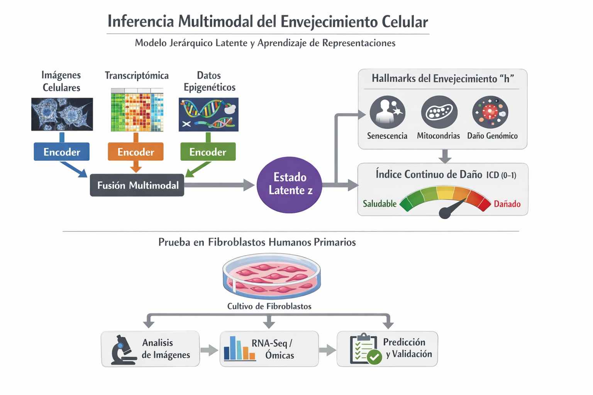

# Modelo latente multimodal de envejecimiento celular en fibroblastos



## Descripción general

Este repositorio contiene el trabajo experimental y de ingeniería del proyecto de tesis de maestría orientado a la **inferencia del envejecimiento celular** mediante un **modelo latente multimodal**. El objetivo central es construir una representación latente `z` que integre señales de **imágenes brightfield**, **RNA-seq**, **metilación** y **biomarcadores escalares** para modelar el estado funcional de fibroblastos humanos primarios y, posteriormente, predecir **hallmarks of aging** y un **Índice Continuo de Daño (ICD)**.

El proyecto está organizado por etapas. Primero se entrenan **encoders unimodales**. Después se alinean y fusionan sus representaciones para construir un embedding común robusto a modalidades faltantes. La célula modelo es el **fibroblasto humano primario** y el dataset principal es el **Cellular Lifespan Study** de Sturm et al.

---

## Objetivo del proyecto

Construir un modelo latente multimodal `z` que permita:

- predecir **edad replicativa** (`PDL`) desde imágenes brightfield,
- aprender embeddings ómicos (`z_rna`, `z_met`, `z_bio`) alineados con envejecimiento,
- fusionar modalidades con datos faltantes reales,
- servir como base para predicción de **hallmarks of aging** e **ICD 0–1**.

---

## Estado actual del proyecto

### MVP-1 — Encoder visual

**Estado:** cerrado.

El encoder visual ya fue entrenado y evaluado. El modelo seleccionado es **A2**, que produce un embedding visual `z_img` de 256 dimensiones y una predicción de `PDL` a partir de imágenes brightfield 10x.

Resumen del resultado final:

- `Spearman` promedio: **0.733**
- `Worst fold`: **0.619**
- Mejora contra baseline trivial: **+44.1%**
- Evidencia de fusion-readiness con biomarcador molecular: correlación parcial significativa con **mtDNA copy number**

Este encoder queda congelado como componente visual para etapas posteriores de fusión.

### MVP-2 — Encoders ómicos

**Estado:** en curso.

Se completaron los baselines clásicos para RNA y metilación. Eso ya fijó el techo realista del problema en esta fase.

Resultados baseline:

- **RNA-seq**: Elastic Net con `Spearman = 0.901`
- **Metilación**: PCA + Elastic Net con `Spearman = 0.772`

Conclusión operativa:

- RNA tiene señal fuerte y bastante lineal.
- Metilación requiere reducción dimensional previa.
- El valor de los encoders profundos no está en vencer al baseline por unas centésimas, sino en producir un **embedding fusionable** y útil para el modelo multimodal final.

### MVP-3 — Fusión multimodal

**Estado:** pendiente.

La fusión planeada ya no se basa en PoE como opción principal. Dado que el número de muestras con triple intersección fuerte es muy bajo, la estrategia actual es:

- **concat + mask**
- entrenamiento con **drop-modality training**

Esta decisión es más realista para el régimen de datos disponible.

---

## Arquitectura conceptual

```text
Imágenes brightfield  → Encoder visual (A2)   → z_img
RNA-seq bulk          → Encoder RNA           → z_rna
Metilación EPIC       → Encoder met           → z_met
Telómero / mtDNA      → Encoder bio           → z_bio
                                  ↓
                       Fusión concat + mask
                                  ↓
                              z fusionado
                                  ↓
                 Hallmarks of Aging + ICD + PDL_hat
```

---

## Estructura sugerida del repositorio

```text
project/
├── README.md
├── figures/
│   └── diagrama_modelo_latente.png
├── data/
│   ├── raw/
│   ├── processed/
│   ├── manifests/
│   └── external/
├── notebooks/
│   ├── 01_manifests/
│   ├── 02_mvp1_visual/
│   ├── 03_mvp2_omics/
│   ├── 04_fusion/
│   └── 05_evaluation/
├── src/
│   ├── data/
│   ├── models/
│   ├── training/
│   ├── evaluation/
│   └── utils/
├── results/
│   ├── mvp1/
│   ├── mvp2/
│   ├── fusion/
│   ├── reports/
│   └── figures/
└── docs/
```

---

## Qué contiene cada carpeta

### `figures/`

Contiene figuras del proyecto para documentación, reportes y README. La imagen principal del diagrama del modelo debe vivir aquí.

Ejemplo:

- `figures/diagrama_modelo_latente.png`

### `data/`

Agrupa los datos del proyecto, idealmente separados por nivel de procesamiento.

#### `data/raw/`
Datos descargados sin modificar o con transformación mínima.

Ejemplos:

- matrices originales de RNA-seq,
- matrices de metilación,
- CSV centrales del estudio,
- metadatos GEO,
- archivos fuente de biomarcadores.

#### `data/processed/`
Datos ya normalizados, filtrados o transformados para modelado.

Ejemplos:

- matrices seleccionadas de genes,
- subconjuntos de CpGs,
- embeddings exportados,
- tablas agregadas por muestra.

#### `data/manifests/`
Carpeta crítica del pipeline. Aquí viven los manifests que funcionan como contrato de datos entre notebooks y modelos.

Los modelos consumen **manifests**, no carpetas sueltas.

Ejemplos esperados:

- `manifest_full_*.csv`
- `manifest_mvp2_master_*.csv`
- `images_manifest.parquet`
- `bulk_manifest.parquet`
- `singlecell_manifest.parquet`

#### `data/external/`
Datasets o recursos complementarios para validación externa o generalización.

Ejemplos:

- GSE115301
- GSE113957
- GSE130973
- otros recursos auxiliares

---

## Notebooks

La carpeta `notebooks/` concentra el trabajo exploratorio, el pipeline de ingesta y los experimentos por fase.

### `notebooks/01_manifests/`
Construcción y auditoría de manifests.

Incluye tareas como:

- parsing de nombres de archivo,
- joins con metadata,
- validación de llaves,
- asignación de folds,
- exportación versionada.

### `notebooks/02_mvp1_visual/`
Notebooks del encoder visual.

Aquí se ubican los experimentos asociados a:

- baseline visual,
- ablations,
- ranking loss,
- consistency loss,
- DANN y variantes,
- modelo final A2,
- exportación de `z_img`.

### `notebooks/03_mvp2_omics/`
Notebooks de RNA, metilación y biomarcadores.

Incluye:

- exploración de matrices,
- selección de genes y CpGs,
- baselines clásicos,
- entrenamiento de encoder RNA,
- entrenamiento de encoder Met,
- chequeos biológicos y batch probes.

### `notebooks/04_fusion/`
Integración de embeddings unimodales.

Contenido esperado:

- concat + mask,
- simulación de modalidades faltantes,
- entrenamiento de capa de fusión,
- predicción multimodal de `PDL`, hallmarks e ICD.

### `notebooks/05_evaluation/`
Evaluación final, generalización externa y reportes.

Ejemplos:

- métricas por fold,
- análisis de error,
- interpretabilidad,
- comparación contra baselines,
- visualizaciones del espacio latente.

---

## `results/`

Contiene salidas reproducibles del proyecto. Debe separar claramente resultados por etapa.

### `results/mvp1/`
Resultados del encoder visual.

Ejemplos:

- pesos de modelos,
- embeddings `z_img`,
- reportes por fold,
- métricas finales,
- artefactos de ablation.

### `results/mvp2/`
Resultados de los encoders ómicos.

Ejemplos:

- modelos RNA y Met,
- métricas baseline,
- rankings de genes,
- PCs, scores y reportes biológicos.

### `results/fusion/`
Resultados de la etapa multimodal.

Ejemplos:

- embeddings fusionados,
- predicciones multimodales,
- desempeño con modalidades faltantes.

### `results/reports/`
Reportes ejecutivos o técnicos exportados en PDF, DOCX o Markdown.

### `results/figures/`
Gráficas finales usadas en informes, tesis o presentaciones.

---

## Decisiones metodológicas importantes

### 1. La unidad de análisis importa

- En imágenes, la evaluación no debe hacerse con split aleatorio por imagen.
- En ómicas, el split debe respetar donante, experimento o batch.
- Si no haces esto, el modelo aprende atajos y luego parece listo cuando en realidad solo memorizó protocolo. Ciencia ficción estadística. Muy elegante. Muy inútil.

### 2. Los manifests son parte del modelo

Este proyecto depende de una capa de ingeniería de datos fuerte. Los manifests no son un accesorio administrativo. Son el contrato que vuelve reproducible el pipeline completo.

### 3. El objetivo no es ganar por décimas al baseline

En MVP-2, el baseline RNA ya es fuerte. El valor agregado del deep learning aquí es producir embeddings alineables y fusionables, no inflar métricas con fuegos artificiales.

### 4. PDL no es edad cronológica

`PDL` representa **edad replicativa in vitro**, no edad humana cronológica. Es un eje útil, pero distinto. Mezclarlos como si fueran lo mismo sería una trampa conceptual.

---

## Fuentes principales del proyecto

- **Cellular Lifespan Study** — Sturm et al., 2022
- Imágenes brightfield del Cellular Lifespan Study
- RNA-seq bulk y metilación del mismo estudio
- Datasets externos para generalización y validación biológica

---

## Estado de madurez por componente

| Componente | Estado |
|---|---|
| Pipeline de manifests | Avanzado |
| MVP-1 encoder visual | Cerrado |
| MVP-2 baseline RNA | Completo |
| MVP-2 baseline metilación | Completo |
| Encoder RNA profundo | En curso |
| Encoder Met profundo | Siguiente etapa |
| Fusión multimodal | Pendiente |
| Hallmarks + ICD | Pendiente |

---

## Uso esperado de este repositorio

Este repositorio busca servir para:

- centralizar código, datos procesados y resultados,
- documentar el progreso experimental por MVP,
- mantener trazabilidad entre manifests, notebooks y artefactos,
- facilitar reproducibilidad para tesis, reportes y futuras extensiones.

---

## Nota final

Este repositorio no representa un producto terminado. Representa un sistema experimental en construcción, con una primera etapa visual cerrada, una segunda etapa ómica en curso y una etapa de fusión multimodal todavía por consolidarse. Eso no es una debilidad. Es el estado real del proyecto, que en investigación vale más que un README inflado.
